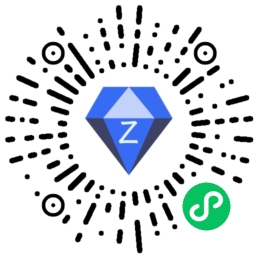
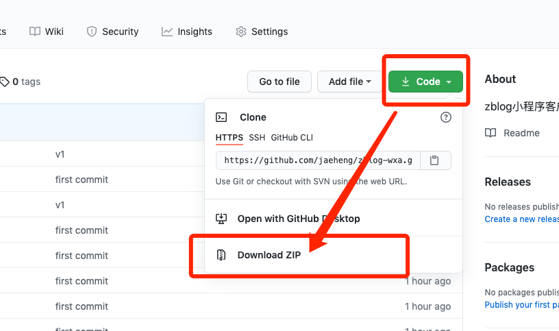
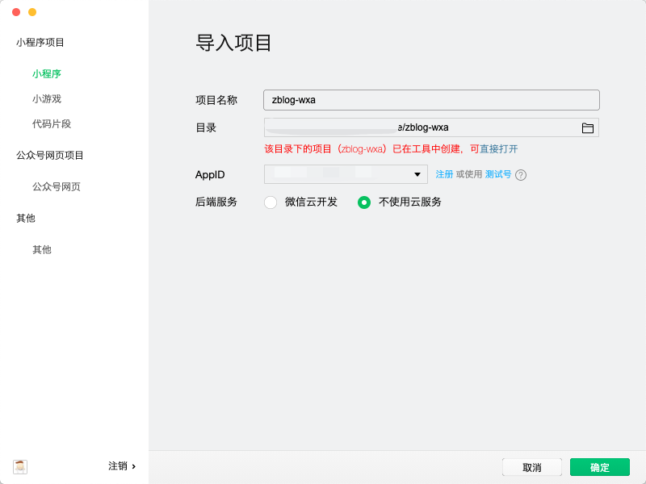

# Z-Blog小程序版客户端

该客户端为微信小程序客户端，接口依赖于Z-Blog博客程序PHP版。开发时的版本为：`1.7.0.2955 (Tenet);`

版本过高或过低可能接口定义不一致，导致无法正常使用，可自行测试。最好可以将测试结果在留言板中留言，供他人参考，留言板地址在文档底部。

小程序预览:



## 安装方法


1. **准备工作:**

Z-Blog小程序版客户端依赖Z-Blog的API接口，所以需要先开启该功能。

```
后台->网站设置->API设置
```

打开`启用API协议`开关并提交即可


2. **下载代码:**

代码托管在Github , 如果你会使用git，可直接克隆该项目:

```
git clone https://github.com/jaeheng/zblogphp-wxa.git
```

如不会使用，则可以打开GitHub代码托管页面下载整个项目,代码托管地址在文档底部可以找到。




3. **导入项目**



使用微信开发者工具导入项目，导入时修改AppId为自己的。


4. 修改接口域名配置

在根目录的`config.js`文件中修改为自己网站的域名(需打开API功能)


完成以上步骤，即可进行二次开发或测试上线。

## 参考链接

留言板地址: https://blog.lightcms.cn/?id=2

代码托管地址: https://github.com/jaeheng/zblogphp-wxa

## License

MIT

